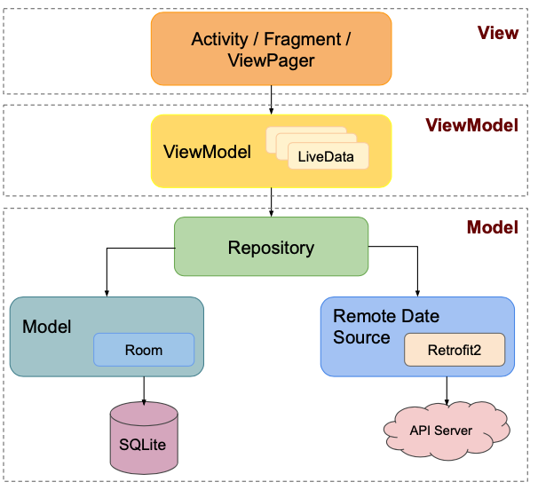

#  Buzzvil Test Android for Interview (BTA)

      

### ● 프로젝트 개요
자사 Buzzvil Test Ads API와 ViewPager를 이용하여 주어진 캠페인 priority와 weight에 따라 컨텐츠, 광고 캠페인을 교차 배치하여 유저에게 표시하는 안드로이드 앱 구현.
UX 차원에서 데이터 로딩 중, 앱 재실행 또는 Screen on/off시에 적절한 View-item 표시.

### ● 프로젝트 분석
Buzzvil의 핵심 사업인 모바일 광고 엔진을 적용한 예시 서비스의 유사 설계 과제로 분석됨,
유사 허니스크린 또는 광고 삽입형 아티클 제공 서비스 설계.

### ● 기술 스택
          

## :globe_with_meridians: 시스템 구조

